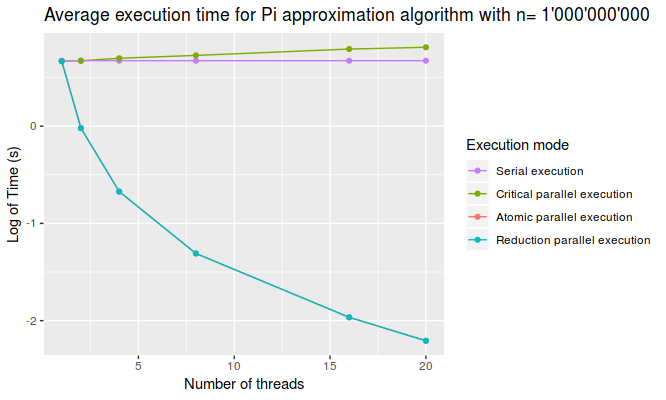

# Assignment 1: Approximate Pi with OMP keywords

In the first exercise for the course of Parallel Programming, our aim is to approximate the value of Pi using the Montecarlo integral approximation.

## Procedure and Results

I implemented the approximation algorithm in four different modes, as required by the assignment: a serial version, a parallel version using the `critical` keyword, a parallel version using the `atomic` keyword and a parallel version using the `reduction` keyword. All parallel versions are using OpenMP for multithreading.

I measured the execution time of all versions on a Ulysses node using 1, 2, 4, 8, 16 and 20 threads to see the scalability of my implementations, with a problem size of 1'000'000'000 using the gcc compiler with optimization -O3. **Table 1** and **Figure 1** show the results obtained through this procedure.

| # Threads | Serial (s) | Critical (s) | Atomic (s) | Reduction (s) |
|-----------|------------|--------------|------------|---------------|
| 1         | 1.96       | 1.95         | 1.95       | 1.95          |
| 2         | 1.96       | 1.96         | 0.98       | 0.99          |
| 4         | 1.96       | 2.01         | 0.51       | 0.51          |
| 8         | 1.96       | 2.07         | 0.27       | 0.27          |
| 16        | 1.96       | 2.21         | 0.14       | 0.14          |
| 20        | 1.96       | 2.25         | 0.11       | 0.11          |
> Table 1: Results of Exercise 1 execution.

> Figure 1: Scalability of MonteCarlo integral approximation for different number of threads.

From the plot and the data it is evident that parallelizing the code leads to significant improvements in terms of execution time.

Parallelization using critical keyword doesn't show any improvement since the function that should be made parallel is executed in a serial fashion to comply to the keyword, and instead adds an additional ovehead due to thread management tasks.

It is interesting to note that the performances of using atomic and reduction keywords are virtually the same, i.e. non-significant differences for this problem size. Intuitively, on the long run the atomic keyword should perform better for this type of operation since it exploits the hardware capabilities on top of performing reduction.

## Reproducibility

In order to test the code, take the following steps:

* Login inside Ulysses using your account.

* Clone this repo using `git clone git@github.com:gsarti/parallel-computing.git`.

* Move inside the assignment folders using `cd parallel-computing/Assignments/`.

* Launch the script using `qsub -l nodes=1:ppn=20,walltime=0:10:00 ex01/ex1.sh`.

* Execution times and results will be available in the file `ex1.sh.o*`.